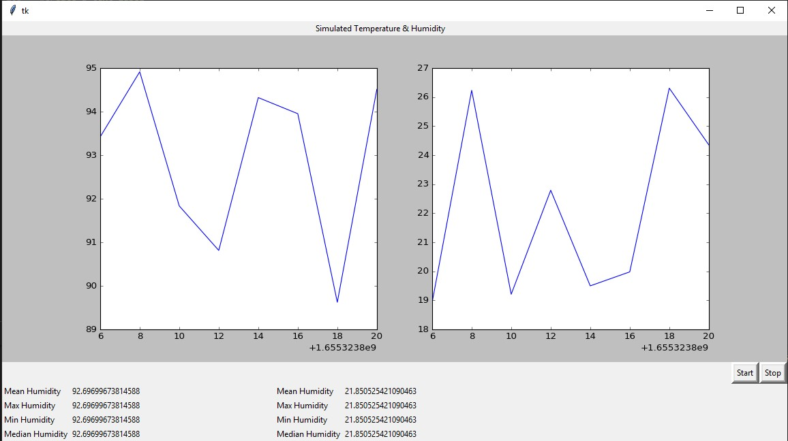

# IoT AED Coding Test

There are 3 solutions of problems presented in the project.


## Number 1
### Description

After fetching data from [listOfUsers](http://jsonplaceholder.typicode.com/users), the program adds two fields: salaryInIDR from salary_data.json, and salaryInUSD from converted values of salaryInIDR using [the API.](https://free.currencyconverterapi.com)
The modification of JSON is done after converting the JSON to a list of dictionaries, and every new fields is added by adding a new dictionary.

### Outputs
The program path is "./JSON/nomor1.py" and the JSON output path is "./nomor_1.json"
The data before and after modification would look similar to this
```python
before = {
    'id': 1, 
    'name': 'Leanne Graham', 
    'username': 'Bret', 'email': 
    'Sincere@april.biz', 
    'address': {
        'street': 'Kulas Light', 'suite': 'Apt. 556', 'city': 'Gwenborough', 'zipcode': '92998-3874', 
        'geo': {'lat': '-37.3159', 'lng': '81.1496'}}, 
    'phone': '1-770-736-8031 x56442', 
    'website': 'hildegard.org', 
    'company': {
        'name': 'Romaguera-Crona', 'catchPhrase': 'Multi-layered client-server neural-net', 
        'bs': 'harness real-time e-markets'}
    }

after = {
    'id': 1, 
    'name': 'Leanne Graham', 
    'username': 'Bret', 'email': 
    'Sincere@april.biz', 
    'address': {
        'street': 'Kulas Light', 'suite': 'Apt. 556', 'city': 'Gwenborough', 'zipcode': '92998-3874', 
        'geo': {'lat': '-37.3159', 'lng': '81.1496'}}, 
    'phone': '1-770-736-8031 x56442', 
    'website': 'hildegard.org', 
    'company': {
        'name': 'Romaguera-Crona', 'catchPhrase': 'Multi-layered client-server neural-net', 
        'bs': 'harness real-time e-markets'}, 
    'salaryInIDR': 4001111.510555328, 
    'salaryInUSD': 271.70942900009686
    }


```


## Number 2
### Description
Data of Humidity and Temperature from sensor_data.json is set to be aggregated based on the same roomArea and the same day from the timestamp field. In order to easily recognize every row of data from the same day, I created a function *getDay* that returns number of days since the epoch. I then updated the column field for every row with the format of "datetime" using **pd.to_datetime** and adds the offset of number of days since the epoch (1 January 1970)

In order to easily aggregate the data, I use Pandas library and created a dataframe from the dictionary or the JSON file. To install pandas, simply use pip.
```bash
pip install pandas
```
This lines then aggregate the dataframe createad, and create a new dataframe with new columns such as humidity_mean and temperature_max.
```python
df = pd.DataFrame(updatedSensorData)

aggSensorData = df.groupby(['roomArea', 'timestamp']).agg({'humidity': ['mean', 'min', 'max','median'],'temperature':['mean', 'min', 'max','median']})
aggSensorData.columns = ['humidity_mean', 'humidity_min', 'humidity_max', 'humidity_median','temperature_mean', 'temperature_min', 'temperature_max', 'temperature_median']
aggSensorData = aggSensorData.reset_index()
```

### Outputs
The program path is "./JSON/nomor2.py" and the JSON output path is "./nomor_2.json" The data before and after aggregation would look similar to this

```python
data_sensor = {
      "temperature": 21.279782079384667,
      "humidity": 87.2525512400796,
      "roomArea": "roomArea1",
      "id": 1,
      "timestamp": 1593666000000
    },
    {
      "temperature": 21.850241860660457,
      "humidity": 89.43461041020686,
      "roomArea": "roomArea2",
      "id": 2,
      "timestamp": 1593666000000
    },
    {
      "temperature": 25.93331731363279,
      "humidity": 90.48683363739528,
      "roomArea": "roomArea3",
      "id": 3,
      "timestamp": 1593666000000
    }
}

aggregatedDataSensor = {"0":{
        "roomArea":"roomArea1",
        "timestamp":1593648000000,
        "humidity_mean":92.2552010302,
        "humidity_min":87.1135114492,
        "humidity_max":96.7640612523,
        "humidity_median":92.0715017759,
        "temperature_mean":20.975726346,
        "temperature_min":17.1749489514,
        "temperature_max":26.6737043854,
        "temperature_median":20.8534597261},
    "1":{
        "roomArea":"roomArea1",
        "timestamp":1593734400000,
        "humidity_mean":91.7996540623,
        "humidity_min":87.4860244733,
        "humidity_max":96.7368132585,
        "humidity_median":92.1737404052,
        "temperature_mean":21.688644721,
        "temperature_min":17.005340237,
        "temperature_max":26.769534267,
        "temperature_median":21.4375773039},
    "2":{
        "roomArea":"roomArea1",
        "timestamp":1593820800000,
        "humidity_mean":91.2891567165,
        "humidity_min":87.1752408199,
        "humidity_max":96.9198212076,
        "humidity_median":90.9599303287,
        "temperature_mean":21.827394042,
        "temperature_min":17.0600484306,
        "temperature_max":26.9072011119,
        "temperature_median":21.6263579309}
    }
```
For notes, the timestamp recorded in the dataframe is written in datetime format. After exporting to json, the recorded timestamp is written in epoch format for further easier operation of timestamp. To export json with timestamp format of iso, please change into this line
```python
nomor_2 = aggSensorData.to_json('./nomor_2.json', orient='index',date_format='iso)
```
## Nomor 3
### Description
This program simulate sensor data of humidity and temperature with the timestamp in epoch format. The step iteration is for every 2 second, so the epoch timestamp would be incremented with the step of 2. The data is generated in random using numpy library from Pandas. 

There are 5 primary function used in the program:

1. animate, when the global pause is set to False, the function keeps generating random value of humidity and temperature and plot them in two side-to-side plot
2. aggregate, when the global pause is set to True, the function updated the global dataframe of sensor data, and calculate [median,max,min,mean]. It then create an aggSensorData similar to problem 2.
3. setPause, this function is used in tkinter button command. If the stop button is pressed, the function would set the global pause to True
4. setResume, serve the the opposite purpose of setPause, this function sets the global pause to False.
5. every_second, this function belongs to root window using Tkinter. For every second, it would update the displayed data of aggregation such as mean,max,min and median.

### Outputs
The program path is "./JSON/nomor3.py" and the JSON output path is "./nomor_3.json" The data of simulation would look similar to this

```python
output = {
        "0":{
            "timestamp":1655323806,
            "humidity":95.753949879,
            "temperature":17.2513526316,
            "roomArea":"roomArea1"},
        "1":{
            "timestamp":1655323808,
            "humidity":96.6564762405,
            "temperature":18.6837295195,
            "roomArea":"roomArea1"},
        "2":{
            "timestamp":1655323810,
            "humidity":94.7925736759,
            "temperature":19.219402959,
            "roomArea":"roomArea1"}
        }  
```
The window of real-time simulation with aggregated data would look like this


## License
[MIT](https://choosealicense.com/licenses/mit/)
